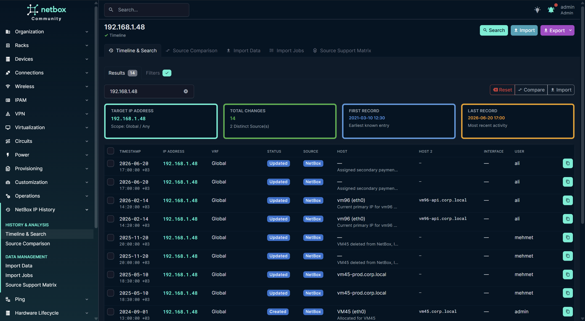
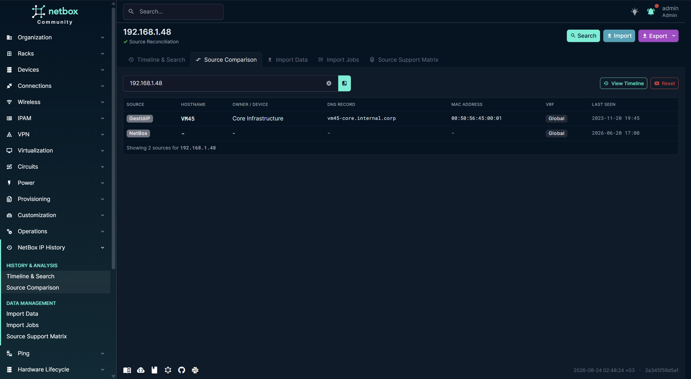
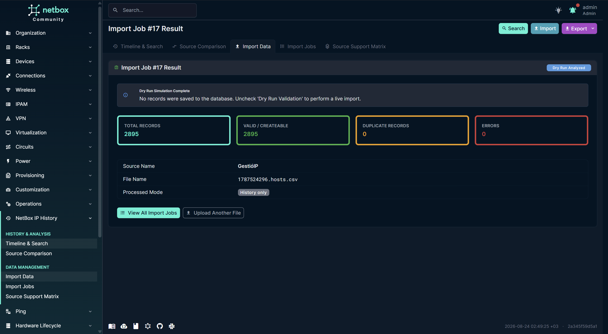
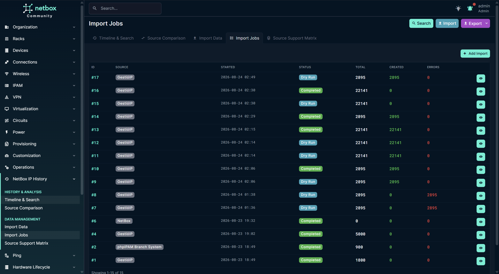
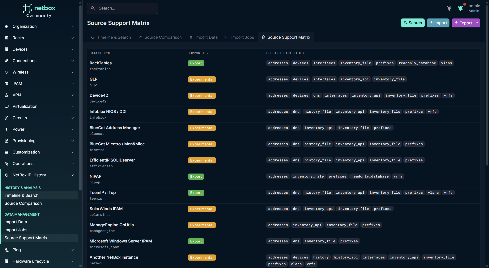

# NetBox IP History

**English** | [Türkçe](README.tr.md)

Documentation: [GitHub Wiki](https://github.com/muratbulat/netbox-ip-history/wiki)

[](https://pypi.org/project/netbox-ip-history/)
[](https://pypi.org/project/netbox-ip-history/)
[](https://github.com/muratbulat/netbox-ip-history/actions/workflows/ci.yml)
[](LICENSE)

<p align="center">
  
</p>

NetBox plugin `0.3.1` provides a canonical-IP timeline combining native NetBox `core.ObjectChange` records with immutable, plugin-owned GestioIP, phpIPAM, CSV, and JSON history. External records retain their source ID, source user, import job, timestamp, normalized scope, and complete `raw_data` snapshot.

**License:** Apache-2.0

## Screenshots

### IP Timeline & Lifecycle Search
<p align="center">
  
</p>

### Multi-Source IP Comparison
<p align="center">
  
</p>

### Historical Data Import (CSV / JSON / JSONL)
<p align="center">
  
</p>

### Import Jobs & Safe Rollback Management
<p align="center">
  
</p>

### Data Source Support Matrix
<p align="center">
  
</p>

## Compatibility

| Plugin | NetBox | Python | Status |
| --- | --- | --- | --- |
| 0.3.x | 4.4.x (v4.4.10) | 3.11 | Verified in CI |
| 0.3.x | 4.5.x (v4.5.10) | 3.12 | Verified in CI |
| 0.3.x | 4.6.x (v4.6.8) | 3.12, 3.14 | Verified in CI; 3.14 is the priority-verified combination |
| 0.3.x | 4.7.x (v4.7.0) | 3.14 | Verified against a real NetBox instance (not yet in CI) |

These are target ranges and verified environments. See [COMPATIBILITY.md](COMPATIBILITY.md) for the evidence matrix.

## Dependencies

Additional mandatory Python dependencies: **None** beyond NetBox's runtime. NetBox supplies Django, PostgreSQL, and Redis requirements. External IPAM connectivity is optional and currently uses administrator-supplied file exports; vendor API/SQL clients are not bundled.

## Installation

### PyPI

```bash
source /opt/netbox/venv/bin/activate
pip install netbox-ip-history
```

### GitHub

```bash
cd /opt && git clone https://github.com/muratbulat/netbox-ip-history.git
cd netbox-ip-history && pip install -e .
```

Full installation, upgrade, disable, and uninstall instructions (including NetBox configuration, migrations, and verification): **[docs/INSTALLATION.md](docs/INSTALLATION.md)** — Turkish version: **[docs/INSTALLATION_TR.md](docs/INSTALLATION_TR.md)**.

The plugin will be available under `/plugins/ip-history/` and directly accessible from NetBox IP Address (`ipam.ipaddress`) detail pages.

## Configuration and security

All web views and API endpoints enforce strict Django model permissions with `raise_exception=True` (denying unauthenticated or unauthorized access with HTTP 403 Forbidden):

- `view_historicalipevent`: Access timeline search (`/plugins/ip-history/`), event details, multi-source comparison, and IP address page extension panels.
- `add_historicalipevent`: Access import data UI (`/plugins/ip-history/import/`).
- `delete_historicalipevent`: Execute safe rollback of import jobs (`/plugins/ip-history/import-jobs/<pk>/rollback/`).
- `view_importjob`: View import job audit logs and details (`/plugins/ip-history/import-jobs/`).
- `view_importsource`: View source matrix and adapter capabilities (`/plugins/ip-history/sources/support/`).

`ImportSource` records store source metadata, timezone, field mapping, support level, capabilities, and authority. Credentials, tokens, and passwords belong in `PLUGINS_CONFIG` or environment variables, never in database model records or logs.

## Formats and workflow

GestioIP and phpIPAM adapters accept CSV/JSON exports and preserve unknown columns. phpIPAM JSON supports arrays and JSON Lines. Generic CSV supports UTF-8/BOM, delimiters, quoting, and source mappings stored on `ImportSource`; generic JSON supports arrays of objects and JSON Lines. Every upload creates an analyzed job; dry run is optional and performs no historical-event writes. The result and error details are visible under `/plugins/ip-history/import-jobs/`.

### Management Commands

Large imports and native synchronization use CLI commands:

```bash
# Import external IPAM history (file export)
python netbox/manage.py import_ip_history --source gestioip --file /data/history.csv --history-only --dry-run
python netbox/manage.py import_ip_history --source phpipam --file /data/export.json --history-only

# Synchronize past native NetBox IP changes from core.ObjectChange into HistoricalIPEvent
python netbox/manage.py sync_netbox_ip_history --dry-run
python netbox/manage.py sync_netbox_ip_history
```

Repeat imports are idempotent through SHA-256 fingerprint deduplication. A permitted administrator can remove only events belonging to a selected job; native NetBox audit data and live inventory are never rolled back.

## Supported source adapters

Adapters are independent registry entries. The support matrix at `/plugins/ip-history/sources/support/` is generated from declarations and inspection results:

| Source | Level | Notes |
| --- | --- | --- |
| GestioIP, phpIPAM | EXPORT | CSV/JSON inventory/history normalization |
| RackTables, NIPAP, TeemIP, Microsoft IPAM, Ralph | EXPORT | Use reviewed exports or read-only source views |
| GLPI, Device42, Infoblox, BlueCat, Micetro, EfficientIP | EXPERIMENTAL | File/API capability is source-version dependent and must be inspected |
| SolarWinds, ManageEngine, Nautobot | EXPERIMENTAL | Inventory/observation data; do not equate discovery with assignment |
| Another NetBox instance | EXPERIMENTAL | REST/export contract; source ObjectChange provenance is retained when retrieved |
| Generic SQL / Other IPAM | EXPERIMENTAL / EXPORT | Administrator-defined mappings; read-only SQL only |

## REST API Endpoints

NetBox REST API endpoints are available under `/api/plugins/ip-history/` (secured by standard NetBox model permissions):

- `GET /api/plugins/ip-history/events/`: List and filter historical IP events.
- `GET /api/plugins/ip-history/jobs/`: List and monitor import jobs.
- `GET /api/plugins/ip-history/sources/`: List configured import source profiles.

## Portable exchange format

Unsupported products can use the stable exchange format without a new adapter:

```json
{
	"format": "netbox-ip-history",
	"version": 1,
	"source": {"type": "other", "name": "Legacy IPAM"},
	"records": [
		{"ip": "10.222.1.33", "timestamp": "2024-01-01T10:00:00+03:00", "owner_name": "APP01", "event_type": "assigned"}
	]
}
```

The same records may be supplied as JSON Lines for large migrations. Map source-native fields in the source profile; unknown fields remain in `raw_data`. Source scopes such as Infoblox network views, Device42 VRF groups, BlueCat configurations, and Micetro address spaces must be explicitly mapped to NetBox VRFs rather than merged by IP alone.

## Timeline and features

Search `/plugins/ip-history/?ip=10.222.1.33` or access the **IP History** menu directly from the NetBox sidebar. Scope is separated by VRF name/RD, and missing scope is shown as `Global / Unknown`. Native records are resolved from snapshots by canonical IP so deleted and recreated IP objects can share one timeline; historical owner/interface strings do not depend on live objects.

The plugin provides:
- Dedicated NetBox sidebar navigation menu (**IP History**) with sub-items for Timeline & Search, Source Comparison, Import Data, Import Jobs, and Source Matrix (without cluttering the generic Plugins menu).
- Direct NetBox IP Address integration: Action button and quick history widget panel on the NetBox `ipam.ipaddress` detail page (`template_content.py`).
- NetBox 4.x Global Search integration indexing IP addresses, hostnames, DNS names, and sources.
- Modern Bootstrap 5 UI with tabbed sub-navigation, stat summary metrics cards, colored event badges, and raw snapshot inspectors.

## Project status

The core historical model, canonical-IP timeline, registry architecture, generic file workflow, and conservative provenance/rollback behavior are implemented. GestioIP, phpIPAM, generic CSV/JSON/JSONL, and portable exchange imports are the validated paths. Vendor modules are deliberately `EXPORT` or `EXPERIMENTAL` until tested against a specific product version; they do not invent API endpoints or audit support.

## Development and testing

Install the plugin into a NetBox development environment, run `python netbox/manage.py migrate`, and execute `python -m unittest discover -s tests -v`. Build with `python -m pip wheel . --no-deps --wheel-dir dist`. New adapters should declare capabilities, return `SourceInspection`, normalize into the DTO contract, preserve `raw_data`, and add sanitized fixtures/tests.

## Support

Bugs and feature requests: [GitHub Issues](https://github.com/muratbulat/netbox-ip-history/issues). General questions: [GitHub Discussions](https://github.com/muratbulat/netbox-ip-history/discussions). Security reports: [SECURITY.md](SECURITY.md) and GitHub Security Advisories.

## Contributing and license

See [CONTRIBUTING.md](CONTRIBUTING.md), [SECURITY.md](SECURITY.md), and [LICENSE](LICENSE). This project is licensed under Apache-2.0.

## Uninstall

Export required history, disable the plugin, run `python netbox/manage.py migrate netbox_ip_history zero` only after confirming retention requirements, remove the package, and restart NetBox services. Native NetBox tables are not modified by this plugin.